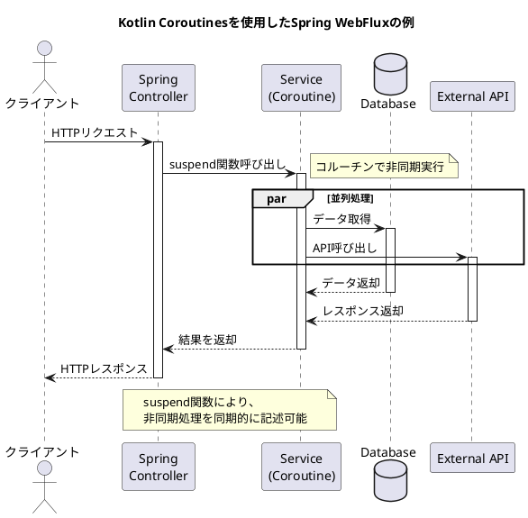
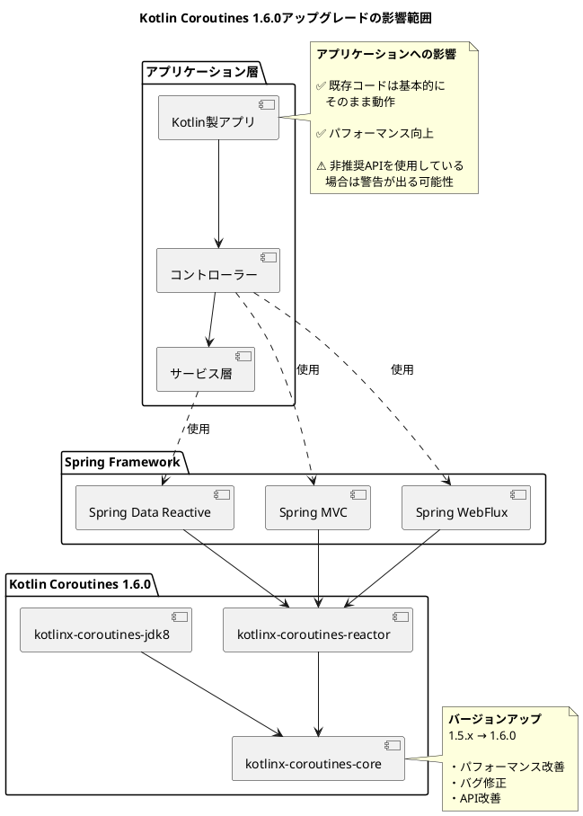

# Issue #27878: Kotlin Coroutines 1.6.0へのアップグレード - 課題サマリー

## 課題概要

### 背景知識
**Kotlin Coroutines（コルーチン）とは**
- Kotlinプログラミング言語における非同期処理を簡潔に書くための仕組み
- 従来のスレッドベースの並行処理よりも軽量で効率的
- `async`/`await`のような構文で、非同期処理を同期処理のように記述できる

**Spring Frameworkとの関係**
- Spring Framework 5以降、Kotlin言語を公式にサポート
- Spring WebFlux（リアクティブプログラミング）でKotlin Coroutinesを使用できる
- Spring MVCでもコルーチン対応のコントローラーメソッドを記述可能

**依存ライブラリのアップグレードの重要性**
- **バグ修正**: 既知の不具合が修正される
- **パフォーマンス向上**: 処理速度やメモリ効率の改善
- **新機能**: 新しいAPIや機能の追加
- **セキュリティ**: 脆弱性の修正
- **互換性**: 他のライブラリとの相互運用性の向上

### Kotlin Coroutines 1.6.0の主な改善点

| カテゴリ | 内容 |
|---------|------|
| パフォーマンス | コルーチンの起動とコンテキスト切り替えの最適化 |
| API改善 | より直感的なAPI、非推奨APIの削除 |
| バグ修正 | メモリリーク、デッドロック、競合状態の修正 |
| 安定性 | 長時間実行時の安定性向上 |
| テスト機能 | テスト用のAPIの充実 |

### Spring Frameworkでの利用例



### コード例の比較

**従来のリアクティブスタイル（Reactor）**
```kotlin
@RestController
class UserController(private val userService: UserService) {
    
    @GetMapping("/users/{id}")
    fun getUser(@PathVariable id: Long): Mono<User> {
        return userService.findById(id)
            .flatMap { user ->
                userService.getOrders(user.id)
                    .map { orders -> user.copy(orders = orders) }
            }
    }
}
```

**Kotlin Coroutinesスタイル（よりシンプル）**
```kotlin
@RestController
class UserController(private val userService: UserService) {
    
    @GetMapping("/users/{id}")
    suspend fun getUser(@PathVariable id: Long): User {
        val user = userService.findById(id)
        val orders = userService.getOrders(user.id)
        return user.copy(orders = orders)
    }
}
```

## 原因

### アップグレードが必要な理由

1. **バージョンの古さ**: 使用していたKotlin Coroutinesのバージョンが古く、最新の改善が取り込まれていない

2. **Spring Framework 6.0の要件**: 
   - Java 17ベースライン
   - Jakarta EE 9への移行
   - これらの変更に合わせて依存ライブラリも最新化する必要がある

3. **エコシステムの進化**: 
   - Kotlin言語自体の進化（Kotlin 1.6系のサポート）
   - 他のJetBrains製品との互換性
   - 業界標準への追従

4. **既知の問題の解決**:
   - メモリリークの修正
   - パフォーマンス問題の改善
   - エッジケースでのバグ修正

## 対応方針

### 修正内容（コミット [a410f4c](https://github.com/spring-projects/spring-framework/commit/a410f4c0f2f9ce10eefd1f7141739d362730cd61)）

#### 1. 依存ライブラリのバージョン更新

**対応内容**:
- Gradle/Mavenのビルド設定ファイルでKotlin Coroutinesのバージョンを1.6.0に更新
- 関連する依存関係の整合性を確認

**修正箇所**:
```gradle
// build.gradle.kts (イメージ)
dependencies {
    // 修正前
    implementation("org.jetbrains.kotlinx:kotlinx-coroutines-core:1.5.x")
    implementation("org.jetbrains.kotlinx:kotlinx-coroutines-reactor:1.5.x")
    
    // 修正後
    implementation("org.jetbrains.kotlinx:kotlinx-coroutines-core:1.6.0")
    implementation("org.jetbrains.kotlinx:kotlinx-coroutines-reactor:1.6.0")
}
```

#### 2. APIの変更への対応

**非推奨APIの置き換え**:
- Kotlin Coroutines 1.6.0で非推奨となったAPIがあれば、新しいAPIに置き換え
- コンパイラ警告のチェックと修正

#### 3. テストの実行と検証

**検証項目**:
| 項目 | 内容 |
|------|------|
| ユニットテスト | 既存のテストがすべてパスすることを確認 |
| 統合テスト | WebFlux、MVCでのコルーチン動作確認 |
| パフォーマンステスト | 性能劣化がないことを確認 |
| 互換性テスト | 他のKotlinライブラリとの互換性確認 |

### アップグレードの影響範囲



### 期待される効果

#### 1. パフォーマンス向上
- コルーチンの起動オーバーヘッド削減
- メモリ使用量の最適化
- CPUキャッシュの効率的な利用

#### 2. 安定性の向上
- メモリリークの修正
- デッドロックの回避
- エラーハンドリングの改善

#### 3. 開発体験の向上
- より直感的なAPI
- デバッグのしやすさ
- IDEサポートの改善

#### 4. 将来性の確保
- Kotlin言語の最新機能への対応
- 長期サポート（LTS）版への準備
- エコシステムとの互換性維持

### 実施タイミング

**Spring Framework 6.0.0-M2（マイルストーン2）でのリリース**
- 早期アダプター向けのプレビューリリース
- フィードバック収集期間
- GA（一般提供）リリース前の最終調整

### 互換性の保証

| 項目 | 状態 |
|------|------|
| ソースコード互換性 | ✅ 維持（既存コードの修正不要） |
| バイナリ互換性 | ✅ 維持（再コンパイル不要） |
| 動作互換性 | ✅ 維持（動作変更なし） |
| API互換性 | ⚠️ 非推奨APIに警告が出る場合あり |

### ユーザーへの推奨事項

1. **Spring Framework 6.0へのアップグレード時**:
   - 自動的にKotlin Coroutines 1.6.0が使用される
   - 特別な対応は不要

2. **非推奨警告が出た場合**:
   - 新しいAPIへの移行を検討
   - ドキュメントで移行ガイドを確認

3. **パフォーマンステストの実施**:
   - アップグレード後のパフォーマンス改善を確認
   - ベンチマークテストの実行を推奨
