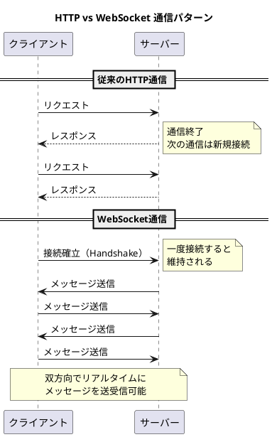
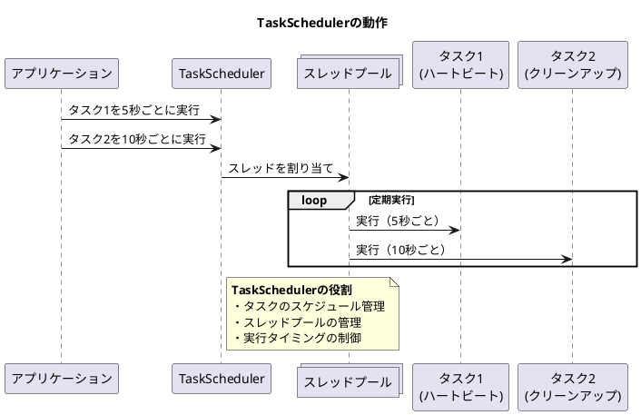
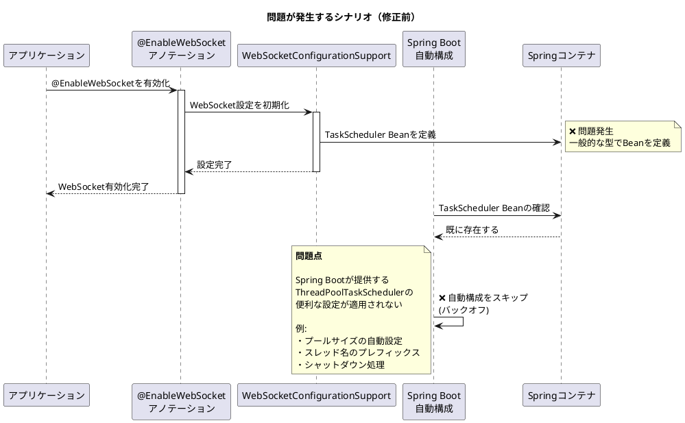
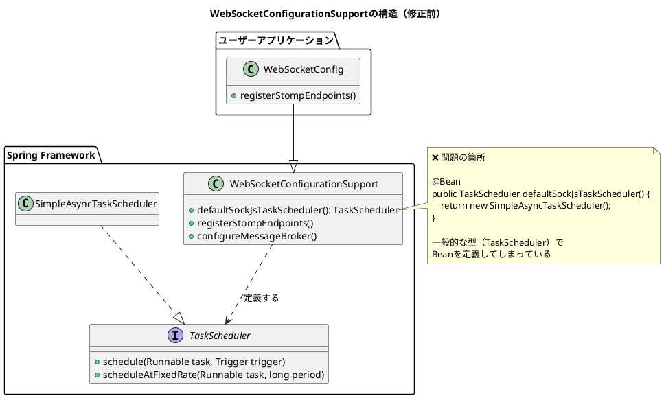
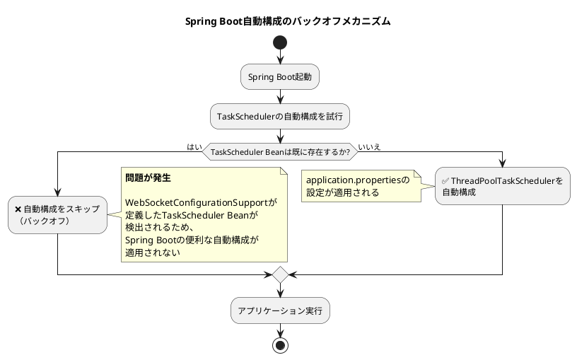
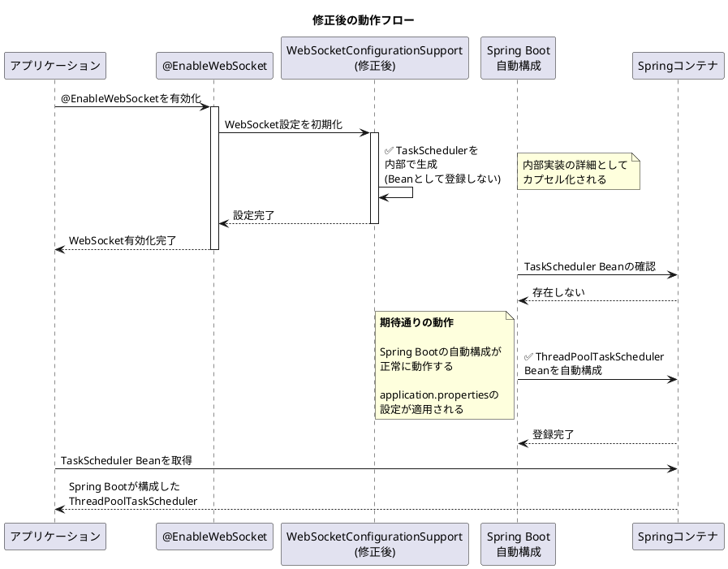
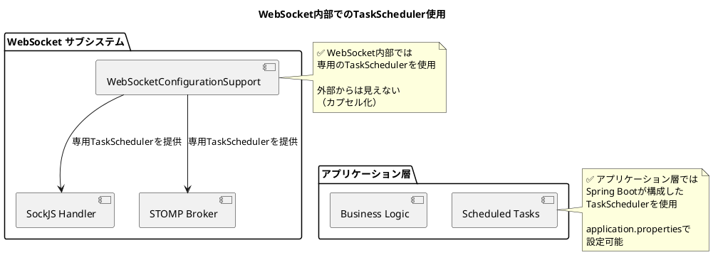
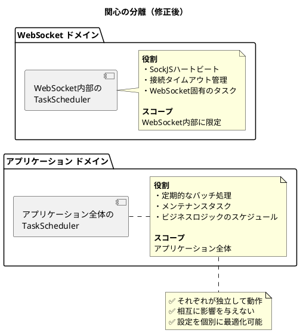

# Issue #27903: WebSocketConfigurationSupportでのTaskScheduler bean定義を停止 - 課題サマリー

## 課題概要

### 背景知識

#### WebSocketとは
**WebSocket**は、HTTPの上に構築されたリアルタイム通信プロトコルです。従来のHTTPリクエスト/レスポンス方式と異なり、サーバーとクライアント間で双方向通信が可能です。

**典型的な利用シーン**:
- チャットアプリケーション
- リアルタイム通知
- 株価・為替のライブ更新
- オンラインゲーム
- コラボレーションツール

**HTTPとWebSocketの違い**


#### TaskSchedulerとは
**TaskScheduler**は、Springフレームワークで定期的なタスクやスケジュール実行を管理するインターフェースです。

**主な用途**:
- 定期的なバックグラウンド処理
- 遅延実行タスク
- WebSocketのハートビート（接続維持）
- セッションタイムアウトの管理

**TaskSchedulerの動作イメージ**


#### Spring Bean（ビーン）とは
**Spring Bean**は、Springコンテナによって管理されるオブジェクトです。Springが自動的に生成、設定、依存関係の注入を行います。

**Beanの特徴**:
- シングルトン（デフォルト）: アプリケーション全体で1つのインスタンス
- ライフサイクル管理: Springが初期化と破棄を管理
- 依存性注入: 他のBeanを自動的に注入

### 問題の詳細

#### 発生している問題
Spring Frameworkの`WebSocketConfigurationSupport`クラスが、`TaskScheduler`型のBeanを自動的に定義してしまうことが問題です。

**なぜこれが問題なのか**:

1. **Spring Bootの自動構成との競合**
   - Spring Bootは`ThreadPoolTaskScheduler`を自動的に構成しようとする
   - しかし、`TaskScheduler` Beanが既に存在すると、自動構成がキャンセルされる（バックオフ）
   - 結果的に、ユーザーが期待する`ThreadPoolTaskScheduler`の設定が適用されない

2. **一般的すぎる契約（Contract）**
   - `TaskScheduler`はアプリケーション全体で使用される一般的なインターフェース
   - WebSocket固有の内部実装の詳細が、アプリケーション全体に影響を与えてしまう
   - 本来は実装の詳細として隠蔽されるべき

3. **設定の複雑化**
   - ユーザーがカスタムTaskSchedulerを定義したい場合に混乱を招く
   - どのTaskSchedulerがどこで使われているか不明確

#### 問題の発生シナリオ



#### 具体的な影響例

**Spring Boot application.propertiesでの設定が無視される**
```properties
# これらの設定が適用されない
spring.task.scheduling.pool.size=10
spring.task.scheduling.thread-name-prefix=scheduling-
spring.task.scheduling.shutdown.await-termination=true
```

**期待される動作 vs 実際の動作**

| 項目 | 期待される動作 | 実際の動作（修正前） |
|------|---------------|---------------------|
| TaskSchedulerの種類 | ThreadPoolTaskScheduler<br>（Spring Boot自動構成） | SimpleAsyncTaskScheduler<br>（WebSocket内部用） |
| スレッドプールサイズ | 設定ファイルで制御可能 | 制御不可（デフォルト値） |
| スレッド名 | カスタマイズ可能 | 内部実装依存 |
| 用途 | アプリケーション全体 | WebSocket専用（のはず） |

### WebSocketConfigurationSupportの役割



## 原因

### 根本原因の分析

#### 1. 設計上の問題
**過度に一般的なBean定義**
- WebSocket内部で使用するTaskSchedulerを、アプリケーション全体で使える一般的な型（`TaskScheduler`）でBean定義している
- これにより、WebSocketの実装の詳細がアプリケーション全体のBean構成に影響を与えてしまう

**カプセル化の不足**
- 本来、WebSocket内部で使用するTaskSchedulerは実装の詳細として隠蔽されるべき
- しかし、現在の実装では外部から見える形でBean定義されている

#### 2. Spring Bootとの統合における問題

**Spring Bootの自動構成メカニズム**


#### 3. 歴史的経緯
- WebSocketConfigurationSupportは古いバージョンのSpring Frameworkで設計された
- 当時はSpring Bootの自動構成が今ほど洗練されていなかった
- 互換性を保つために変更されずに残っていた

### なぜSpring Framework 6.0で修正可能なのか

**メジャーバージョンアップの利点**:
- 破壊的変更（Breaking Change）が許容される
- 後方互換性を犠牲にしても、より良い設計に変更できる
- Spring Framework 6.0はJava 17ベースラインなど、多くの変更が含まれる

**Spring Framework 5.3.xでは修正できない理由**:
- マイナーバージョンでは後方互換性を維持する必要がある
- 既存のアプリケーションが壊れる可能性がある

## 対応方針

### 修正内容（コミット [29fe109](https://github.com/spring-projects/spring-framework/commit/29fe1094403264c4f9583619fdd9e904fc463e8c) および [3682019](https://github.com/spring-projects/spring-framework/commit/368201975a0b9e65b051a71d0894783bcbc4c593)）

#### 修正の基本方針

**3つのアプローチ**:

1. **Bean定義の削除**: TaskScheduler Beanを完全に定義しない
2. **WebSocket固有の型を使用**: より具体的な型でBean定義する
3. **内部で直接インスタンス化**: Beanとして登録せず、内部で使用

**採用されたアプローチ**: **Option 1 - Bean定義の削除** + **内部で直接インスタンス化**

### 修正前後の比較

#### 修正前のコード（イメージ）
```java
@Configuration
public class WebSocketConfigurationSupport {
    
    // ❌ 問題: 一般的な型でBean定義
    @Bean
    public TaskScheduler defaultSockJsTaskScheduler() {
        ThreadPoolTaskScheduler scheduler = new ThreadPoolTaskScheduler();
        scheduler.setThreadNamePrefix("SockJS-");
        scheduler.setPoolSize(Runtime.getRuntime().availableProcessors());
        scheduler.setRemoveOnCancelPolicy(true);
        return scheduler;
    }
    
    // このTaskSchedulerを内部で使用
    protected TaskScheduler getSockJsTaskScheduler() {
        return defaultSockJsTaskScheduler();
    }
}
```

#### 修正後のコード（イメージ）
```java
@Configuration
public class WebSocketConfigurationSupport {
    
    // ✅ 解決: Beanとして定義しない（@Beanアノテーションなし）
    private TaskScheduler sockJsTaskScheduler;
    
    protected TaskScheduler getSockJsTaskScheduler() {
        if (this.sockJsTaskScheduler == null) {
            // 内部で直接インスタンス化
            ThreadPoolTaskScheduler scheduler = new ThreadPoolTaskScheduler();
            scheduler.setThreadNamePrefix("SockJS-");
            scheduler.setPoolSize(Runtime.getRuntime().availableProcessors());
            scheduler.setRemoveOnCancelPolicy(true);
            scheduler.initialize();
            this.sockJsTaskScheduler = scheduler;
        }
        return this.sockJsTaskScheduler;
    }
}
```

### 修正の詳細フロー



### 修正による影響範囲

#### 1. WebSocket機能への影響

**WebSocket内部での使用**:


#### 2. アプリケーションコードへの影響

**修正前後での動作の違い**

| シナリオ | 修正前 | 修正後 |
|---------|--------|--------|
| @EnableWebSocketのみ使用 | WebSocketのTaskSchedulerが<br>アプリケーション全体に影響 | WebSocket内部で完結<br>他に影響なし |
| @EnableSchedulingと併用 | Spring BootのTaskScheduler<br>自動構成が無効化 | ✅ 両方が独立して動作 |
| カスタムTaskScheduler定義 | WebSocketのものと競合の可能性 | ✅ 競合しない |
| application.properties設定 | ❌ 設定が無視される | ✅ 設定が適用される |

#### 3. 後方互換性への影響

**破壊的変更（Breaking Change）**:
- TaskScheduler BeanがSpringコンテナに登録されなくなる
- このBeanに依存していたコードは影響を受ける

**影響を受けるケース**:
```java
// ❌ このようなコードは動作しなくなる
@Configuration
public class CustomConfig {
    @Autowired
    @Qualifier("defaultSockJsTaskScheduler")
    private TaskScheduler webSocketScheduler;  // Beanが存在しない
    
    // ...
}
```

**推奨される移行パス**:
```java
// ✅ カスタムTaskSchedulerを明示的に定義
@Configuration
public class CustomConfig {
    @Bean
    public TaskScheduler customWebSocketScheduler() {
        ThreadPoolTaskScheduler scheduler = new ThreadPoolTaskScheduler();
        // カスタム設定
        scheduler.setPoolSize(20);
        return scheduler;
    }
    
    @Bean
    public WebSocketConfigurer webSocketConfigurer(TaskScheduler customWebSocketScheduler) {
        return registry -> {
            // カスタムSchedulerを使用
        };
    }
}
```

### 期待される効果

#### 1. Spring Bootとのシームレスな統合

**自動構成が正常に動作**:
```properties
# application.properties
# これらの設定が正しく適用されるようになる

# スレッドプールサイズ
spring.task.scheduling.pool.size=10

# スレッド名のプレフィックス
spring.task.scheduling.thread-name-prefix=app-scheduler-

# シャットダウン時の待機
spring.task.scheduling.shutdown.await-termination=true
spring.task.scheduling.shutdown.await-termination-period=30s
```

#### 2. 関心の分離（Separation of Concerns）



#### 3. 設定の柔軟性向上

**ユースケース別の最適化が可能**:

| ユースケース | 設定内容 | 効果 |
|-------------|---------|------|
| 高負荷WebSocketサーバー | WebSocket用に専用の大きなプール | 接続処理の高速化 |
| バッチ処理メインアプリ | アプリケーション全体で大きなプール | バッチ処理の並列実行 |
| マイクロサービス | 小さなプールで軽量化 | リソース効率の向上 |

#### 4. デバッグとメンテナンスの改善

**問題の切り分けが容易に**:
```
修正前: TaskSchedulerの問題が発生
  ↓
  WebSocketの問題？アプリケーションの問題？不明確

修正後: TaskSchedulerの問題が発生
  ↓
  どちらのTaskSchedulerか明確
  ↓
  原因の特定が容易
```

### まとめ

#### 修正のポイント
1. ✅ WebSocket内部のTaskSchedulerをBean定義から除外
2. ✅ 内部で直接インスタンス化してカプセル化
3. ✅ Spring Bootの自動構成が正常に動作
4. ✅ アプリケーション全体とWebSocketの関心を分離

#### ユーザーへの影響
- **ほとんどのユーザー**: 影響なし、むしろ動作が改善
- **TaskScheduler Beanに直接依存していたユーザー**: カスタム定義が必要
- **Spring Boot使用者**: application.propertiesの設定が有効になる

#### 移行の推奨事項
1. 既存コードで`defaultSockJsTaskScheduler` Beanに依存していないか確認
2. 依存している場合は、カスタムTaskSchedulerを明示的に定義
3. テストを実行してWebSocket機能が正常に動作することを確認
