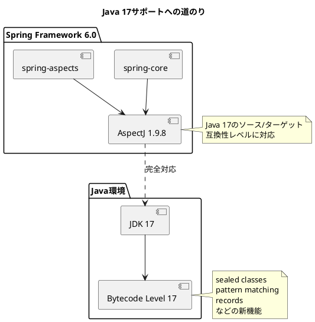
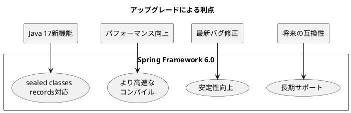

# Issue #27416/27814/27985/28020: 依存関係のアップグレード

## 課題概要

Spring Framework 6.0.0-M3では、Java 17への完全対応とAOT(Ahead-of-Time)コンパイル機能の強化のため、複数の重要な依存関係をアップグレードしました。

### アップグレードされた依存関係

| ライブラリ | 旧バージョン | 新バージョン | Issue番号 | 主な理由 |
|-----------|------------|------------|----------|---------|
| AspectJ | 1.9.7以前 | 1.9.8 GA | #27416 | Java 17の正式サポート |
| Kotlin | 1.5.x | 1.6.20 | #27814 | バイトコードレベルをJava 17に対応 |
| Groovy | 3.x | 4.0 | #27985 | Java 17サポートと最新機能 |
| Gradle | 7.3.3 | 7.4 | #28020 | ビルドツールの最新化 |

### AspectJ 1.9.8の重要性

**AspectJとは**

AspectJは、アスペクト指向プログラミング(AOP)を実現するための拡張Javaです。Springでは、トランザクション管理、セキュリティ、ロギングなどの横断的関心事を実装するために使用されます。

**Java 17サポートの必要性**



### Kotlinバイトコードレベル引き上げ

**背景**

Kotlinで書かれたSpring Frameworkのコード(主にKotlin拡張機能)も、Java 17のバイトコードレベルにコンパイルする必要があります。

**必要な修正**

- Kotlin 1.6.20以降が必要: [KT-49329](https://youtrack.jetbrains.com/issue/KT-49329)のバグ修正が含まれる
- 言語レベル設定: `jvmTarget = "17"`に変更

## 原因

### AspectJ (#27416)

**アップグレード前の状況**

```gradle
// spring-aspects.gradle (問題のある設定)
tasks.named('compileAspectj') {
    sourceCompatibility = '1.8'  // Java 8に制限
    targetCompatibility = '1.8'
}
```

Spring Framework 6.0はJava 17をベースラインとしていますが、AspectJの古いバージョンではJava 17の機能が正しくコンパイルできませんでした。

**具体的な問題**
- sealed class、records、pattern matchingなどのJava 17新機能をAspectJが処理できない
- ビルド時に互換性エラーが発生
- 最新のJava機能を活用したコードが書けない

### Kotlin (#27814)

Kotlinコンパイラがバイトコードを生成する際、JVMターゲットバージョンを指定する必要があります。古いバージョンのKotlinでは、Java 17特有のバイトコードパターンを正しく生成できない問題がありました。

## 対応方針

### AspectJ 1.9.8 GAへのアップグレード (#27416)

#### 実施内容

1. **依存関係の更新**

```gradle
// build.gradle
ext {
    aspectjVersion = "1.9.8"  // 1.9.7から更新
}

dependencies {
    compile("org.aspectj:aspectjweaver:${aspectjVersion}")
    compile("org.aspectj:aspectjrt:${aspectjVersion}")
}
```

2. **コンパイル設定の復元**

```gradle
// spring-aspects.gradle
tasks.named('compileAspectj') {
    sourceCompatibility = JavaVersion.VERSION_17
    targetCompatibility = JavaVersion.VERSION_17
    // 1.8へのダウングレード設定を削除
}
```

3. **Spring Boot連携**

Spring Boot側でも対応が必要なため、関連課題([spring-boot#29754](https://github.com/spring-projects/spring-boot/issues/29754))と連携して進めました。

#### コミットでの変更

- [4e3d1fa](https://github.com/spring-projects/spring-framework/commit/4e3d1fa4e9da90b21c2e19c29037f0d687ee4f3e): AspectJ 1.9.8へのアップグレード
- [2019e17](https://github.com/spring-projects/spring-framework/commit/2019e176ee9c75c2f20ce68a82df2cf1a2af872a): Java 17言語レベルの有効化

#### バックポート

5.3.xブランチにもバックポートされ、既存アプリケーションでもAspectJ 1.9.8を使用できるようになりました(#28060)。

### Kotlin 1.6.20へのアップグレード (#27814)

#### 実施内容

```kotlin
// build.gradle.kts
kotlin {
    jvmToolchain {
        languageVersion.set(JavaLanguageVersion.of(17))
    }
    compilerOptions {
        jvmTarget.set(JvmTarget.JVM_17)  // Java 17バイトコード
        freeCompilerArgs.add("-Xjsr305=strict")
    }
}
```

#### コミットでの変更

- [6c42bcf](https://github.com/spring-projects/spring-framework/commit/6c42bcfaec45128f7b0807676288552912a1b234): KotlinクラスのJava 17バイトコードレベル対応

### その他のアップグレード

**Groovy 4.0** (#27985)
- Java 17サポート
- 本文なしの課題(依存関係バージョン更新のみ)

**Gradle 7.4** (#28020)
- ビルドツールの最新化
- [リリースノート](https://docs.gradle.org/7.4/release-notes.html)参照

## 影響範囲

### 開発者への影響

| 影響 | 内容 | 対応 |
|-----|------|-----|
| JDK要件 | JDK 17以上が必須 | 開発環境のアップグレード |
| AspectJ | 古いAspectJバージョンとの非互換性 | AspectJ 1.9.8にアップグレード |
| Kotlin | Kotlin 1.6.20未満では動作しない可能性 | Kotlinバージョンのアップグレード |
| ビルド | Gradle 7.4推奨 | Gradle Wrapperの更新 |

### 利点



- **言語機能の活用**: Java 17の新機能(sealed class、recordsなど)を完全にサポート
- **パフォーマンス**: 最新バージョンの最適化を享受
- **バグ修正**: 既知の問題が解決済み
- **将来性**: 長期サポート(LTS)バージョンへの対応
