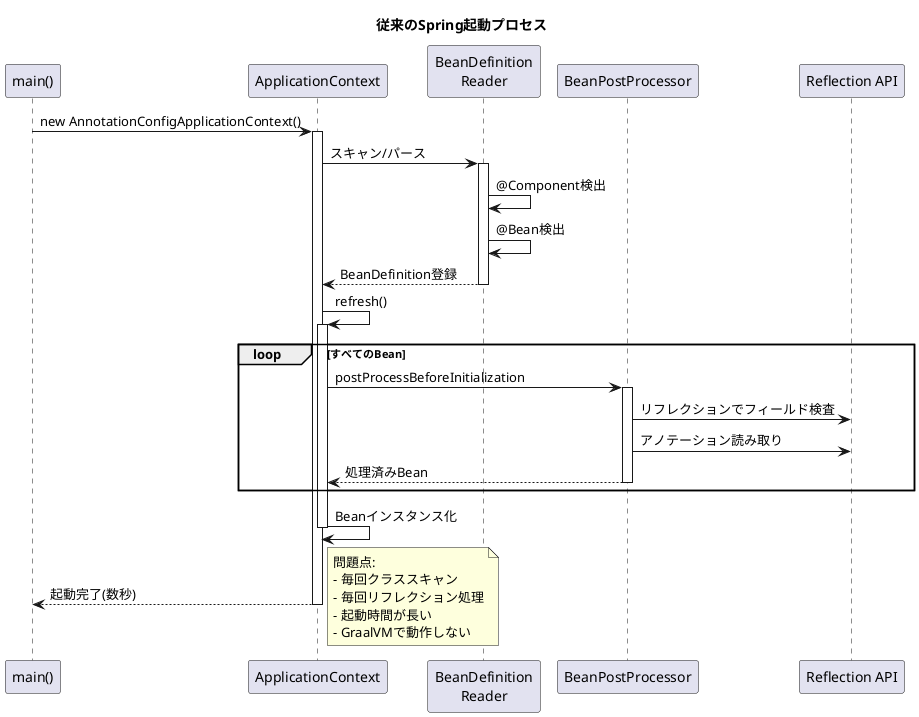
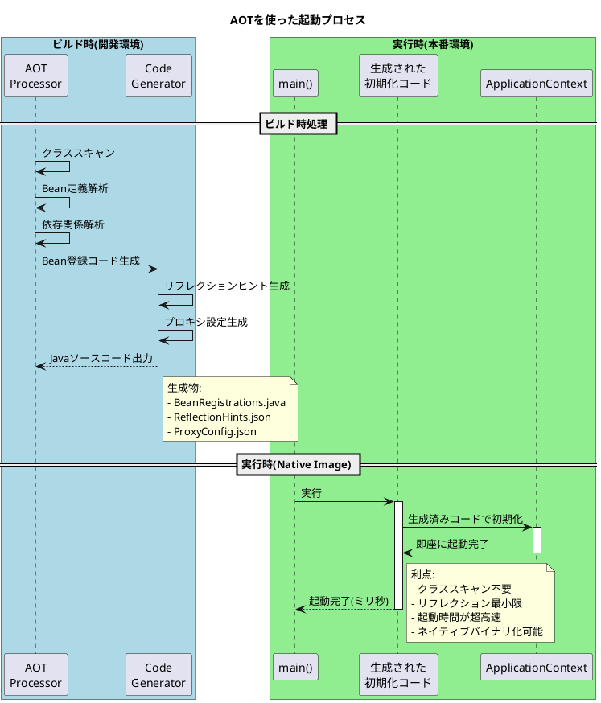
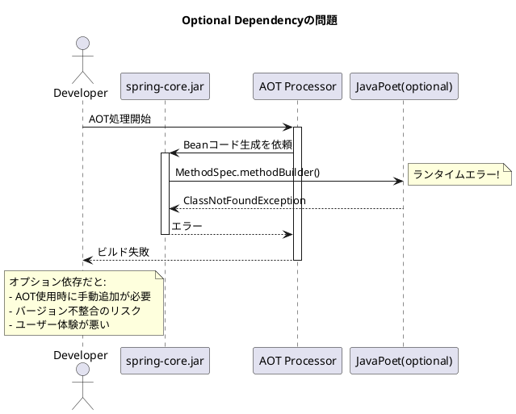
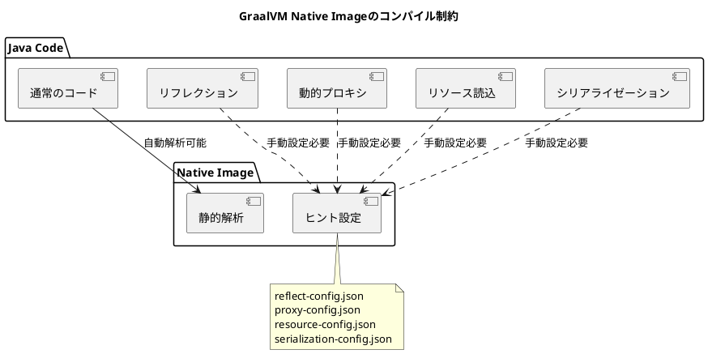
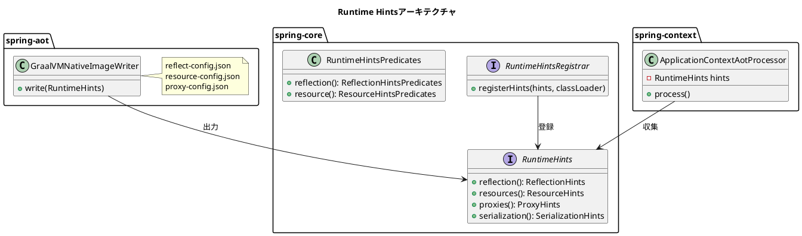
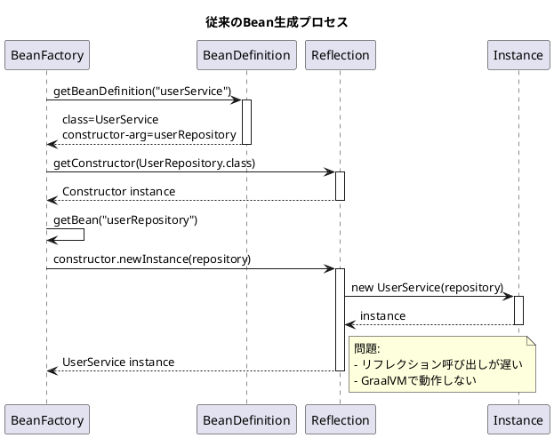
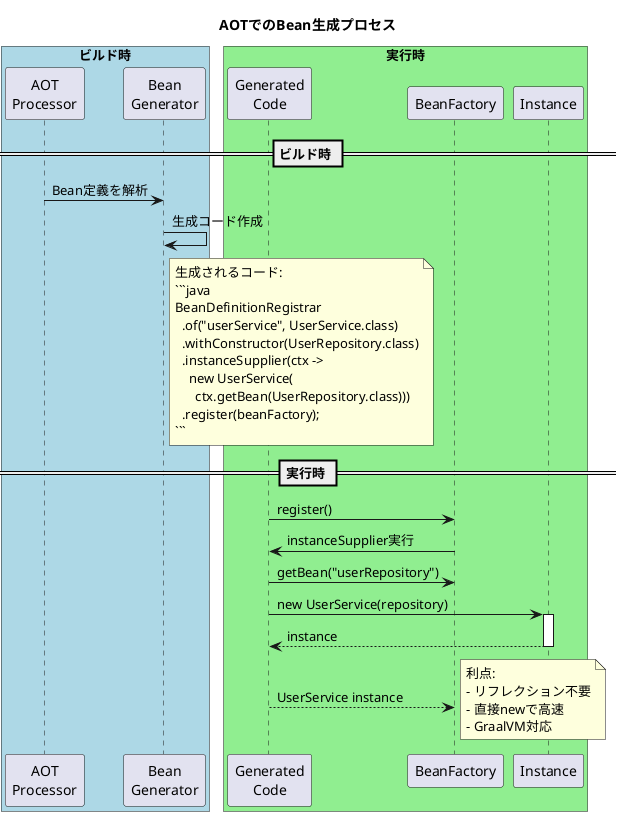
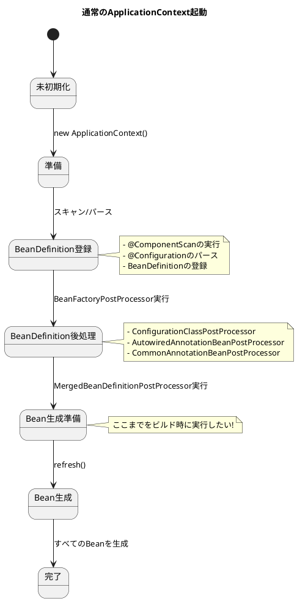
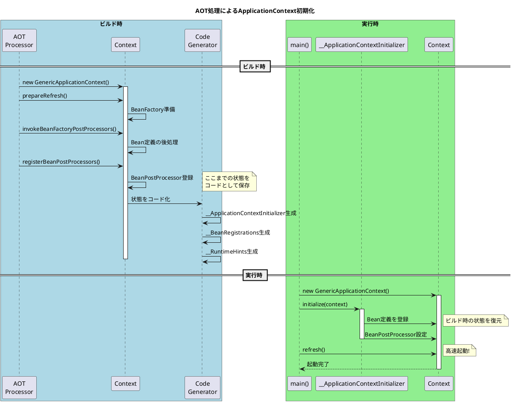
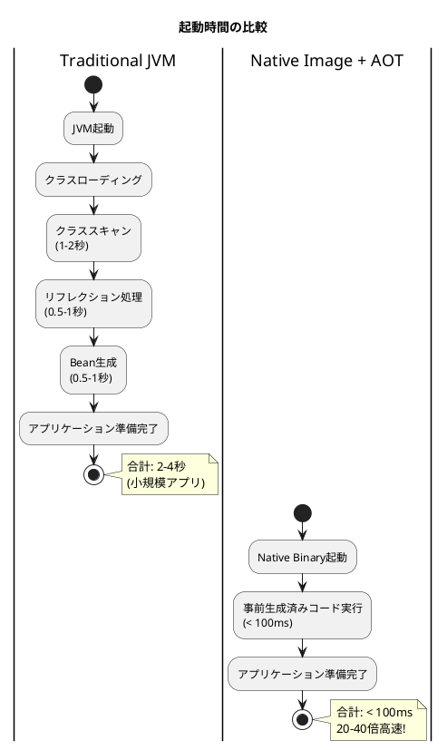

# Issue #27828/27829/28028/28047/28065: AOT(Ahead-of-Time)コンパイル基盤の構築

## 課題概要

Spring Framework 6.0では、GraalVM Native Imageに対応するためAOT(Ahead-of-Time)コンパイル機能を導入しました。これにより、アプリケーションをネイティブバイナリとしてコンパイルし、起動時間を劇的に短縮できます。

### AOTとは何か

**従来のSpring起動プロセス(JIT: Just-In-Time)**



**AOTを使った起動プロセス**



### 関連する課題の全体像

| Issue | タイトル | 役割 |
|-------|---------|------|
| #27828 | JavaPoetのリパッケージング | コード生成ライブラリの統合 |
| #27829 | Runtime Hints登録API | GraalVM設定のプログラム的記述 |
| #28028 | コアJavaPoetユーティリティ | コード生成の共通処理 |
| #28047 | Beanインスタンス化ジェネレーター | Bean登録コードの自動生成 |
| #28065 | ApplicationContext AOT処理 | コンテキスト初期化のビルド時最適化 |

## Issue #27828: JavaPoetのリパッケージング

### 背景知識

**JavaPoetとは**

JavaPoetは、Javaソースコードを動的に生成するためのライブラリです。文字列連結ではなく、タイプセーフなAPIを提供します。

```java
// JavaPoetの使用例
MethodSpec main = MethodSpec.methodBuilder("main")
    .addModifiers(Modifier.PUBLIC, Modifier.STATIC)
    .returns(void.class)
    .addParameter(String[].class, "args")
    .addStatement("$T.out.println($S)", System.class, "Hello, World!")
    .build();

TypeSpec helloWorld = TypeSpec.classBuilder("HelloWorld")
    .addModifiers(Modifier.PUBLIC, Modifier.FINAL)
    .addMethod(main)
    .build();

JavaFile javaFile = JavaFile.builder("com.example", helloWorld)
    .build();

javaFile.writeTo(System.out); // Javaコードを出力
```

### 原因

**Spring CoreがJavaPoetを必要とする理由**

AOT処理では、以下のようなコードを動的に生成する必要があります:

```java
// AOTで生成したいコードの例
public class __BeanRegistrations {
    public static void registerBeans(DefaultListableBeanFactory beanFactory) {
        BeanDefinitionRegistrar.of("userService", UserService.class)
            .withConstructor(UserRepository.class)
            .instanceSupplier((context) -> 
                new UserService(context.getBean(UserRepository.class)))
            .register(beanFactory);
            
        BeanDefinitionRegistrar.of("userController", UserController.class)
            .withConstructor(UserService.class)
            .instanceSupplier((context) -> 
                new UserController(context.getBean(UserService.class)))
            .register(beanFactory);
    }
}
```

このようなコードを文字列操作で生成すると:
- 型安全性がない
- 構文エラーが発生しやすい
- インポート文の管理が困難

**依存関係の問題**

`spring-core`にJavaPoetを通常の依存関係として追加すると、すべてのSpringアプリケーションがJavaPoetをクラスパスに持つことになります。しかし、AOT処理はビルド時のみ必要で、実行時には不要です。

### 対応方針の変遷

#### 案1: Optional Dependency(2022年1月)

```xml
<!-- pom.xmlでの試み -->
<dependency>
    <groupId>com.squareup</groupId>
    <artifactId>javapoet</artifactId>
    <optional>true</optional> <!-- オプション依存にする -->
</dependency>
```

**問題点**



実際のSpring Frameworkメンバーのコメントから:

> "Unfortunately, the design evolution has shown that using an optional external dependency is quite awkward. This commit goes back to repackaging javapoet."
> (残念ながら、設計の進化により、外部のオプション依存関係を使用することが非常に不便であることが判明しました。このコミットではjavapoetを再パッケージ化する方式に戻ります。)

#### 案2: Repackaging(最終決定)

```bash
# パッケージ名の変更
com.squareup.javapoet.* 
  ↓
org.springframework.javapoet.*
```

**実装**

```gradle
// build.gradle
configurations {
    javapoet
}

dependencies {
    javapoet("com.squareup:javapoet:1.13.0")
}

task repackageJavaPoet(type: Sync) {
    from {
        configurations.javapoet.collect { 
            zipTree(it).matching {
                include 'com/squareup/javapoet/**'
            }
        }
    }
    into "$buildDir/repackaged"
    
    // パッケージ名を変更
    filter { line ->
        line.replace('com.squareup.javapoet', 'org.springframework.javapoet')
    }
}

jar {
    dependsOn repackageJavaPoet
    from "$buildDir/repackaged"
}
```

**利点**

| 観点 | 説明 |
|------|------|
| ユーザー体験 | 追加の依存関係設定が不要 |
| バージョン管理 | Springが動作保証するバージョンを内包 |
| クラスパス | 外部ライブラリとの競合を回避 |
| パフォーマンス | 最適化されたバージョンを使用可能 |

### コミットでの変更

13個のコミットで段階的に実装:

1. **初期検討** ([67a8f12](https://github.com/spring-projects/spring-framework/commit/67a8f12)): オプション依存として追加
2. **問題発覚** ([3f7c042](https://github.com/spring-projects/spring-framework/commit/3f7c042)): オプション依存の不便さを認識
3. **リパッケージング実装** ([73c8e91](https://github.com/spring-projects/spring-framework/commit/73c8e91) 〜 [f3a1e29](https://github.com/spring-projects/spring-framework/commit/f3a1e29)): ビルドスクリプトの整備
4. **統合** ([final commit](https://github.com/spring-projects/spring-framework/commit/...)): 完全な統合

## Issue #27829: Runtime Hints登録API

### 背景知識

**GraalVM Native Imageの制約**

GraalVMでネイティブイメージを作成する際、以下の制約があります:



**Spring Nativeでの実装**

Spring Nativeプロジェクトでは`NativeConfigurationRegistry`を提供していました:

```java
// Spring Nativeの実装例
@NativeHint(
    types = @TypeHint(types = UserService.class, access = AccessBits.ALL),
    resources = @ResourceHint(patterns = "application.yml")
)
public class MyNativeConfiguration implements NativeConfiguration {
    @Override
    public void register(NativeConfigurationRegistry registry) {
        registry.reflection().forType(UserService.class).withAccess(AccessBits.ALL);
        registry.resources().add("application.yml");
    }
}
```

### 原因

Spring Framework 6.0でAOTを本体に統合するにあたり、以下の問題がありました:

1. **ネイティブ特化しすぎ**: "Native"という名前がGraalVM専用を示唆
2. **他の用途**: リフレクション情報は他の最適化にも有用
3. **モジュール化**: `spring-core`に汎用的なインフラが必要

### 対応方針

#### 新しいAPI設計

```java
// Spring Framework 6.0の新しいAPI
public interface RuntimeHints {
    ReflectionHints reflection();
    ResourceHints resources();
    ProxyHints proxies();
    SerializationHints serialization();
    JNIHints jni();
}

// 使用例
public class MyRuntimeHintsRegistrar implements RuntimeHintsRegistrar {
    @Override
    public void registerHints(RuntimeHints hints, ClassLoader classLoader) {
        // リフレクションヒント
        hints.reflection()
            .registerType(UserService.class, MemberCategory.INVOKE_DECLARED_CONSTRUCTORS)
            .registerType(UserRepository.class, MemberCategory.INVOKE_PUBLIC_METHODS);
        
        // リソースヒント
        hints.resources()
            .registerPattern("application*.yml")
            .registerPattern("messages*.properties");
        
        // プロキシヒント
        hints.proxies()
            .registerJdkProxy(UserService.class, Transactional.class);
    }
}
```

**アーキテクチャ**



#### 実装例

**Before: Spring Native**

```json
// reflect-config.json (手書き)
[
  {
    "name": "com.example.UserService",
    "allDeclaredConstructors": true,
    "allPublicMethods": true
  },
  {
    "name": "com.example.UserRepository",
    "allPublicMethods": true
  }
]
```

**After: Spring Framework 6.0**

```java
// Javaコードで宣言的に記述
@Configuration
@ImportRuntimeHints(MyRuntimeHintsRegistrar.class)
public class AppConfig {
    @Bean
    public UserService userService(UserRepository repository) {
        return new UserService(repository);
    }
}

public class MyRuntimeHintsRegistrar implements RuntimeHintsRegistrar {
    @Override
    public void registerHints(RuntimeHints hints, ClassLoader classLoader) {
        // タイプセーフなAPI
        hints.reflection()
            .registerType(UserService.class, 
                builder -> builder
                    .withConstructor(Collections.emptyList(), ExecutableMode.INVOKE)
                    .withMethod("process", Collections.singletonList(String.class), ExecutableMode.INVOKE));
    }
}
```

### コミットでの変更

21個のコミットで段階的に実装:

1. **基本インフラ** ([5f8198d](https://github.com/spring-projects/spring-framework/commit/5f8198d)): `RuntimeHints`インターフェースの導入
2. **各種ヒント実装** ([7c2f94c](https://github.com/spring-projects/spring-framework/commit/7c2f94c) 〜 [cb44ef0](https://github.com/spring-projects/spring-framework/commit/cb44ef0)): ReflectionHints, ResourceHintsなど
3. **登録機構** ([578d04f](https://github.com/spring-projects/spring-framework/commit/578d04f)): `RuntimeHintsRegistrar`の実装
4. **統合** ([残りのコミット]): 既存のSpring機能との統合

## Issue #28028: コアJavaPoetユーティリティ

### 原因

Spring Nativeでプロトタイプ開発を進める中で、以下のような反復的なコードパターンが頻出しました:

```java
// 繰り返し書かれるコード
CodeBlock.Builder code = CodeBlock.builder();
code.beginControlFlow("if ($L != null)", variableName);
code.addStatement("$L.init()", variableName);
code.endControlFlow();

// インポート管理の手動処理
code.addStatement("$T logger = $T.getLogger($T.class)", 
    Logger.class, LoggerFactory.class, MyClass.class);
// → インポート文を別途管理する必要がある
```

### 対応方針

**ユーティリティクラスの追加**

```java
// Spring Framework 6.0で追加されたユーティリティ
public class CodeSnippet {
    /**
     * 複数のステートメントをまとめて生成
     */
    public static CodeBlock of(Consumer<CodeBlock.Builder> statements) {
        CodeBlock.Builder builder = CodeBlock.builder();
        statements.accept(builder);
        return builder.build();
    }
    
    /**
     * 条件文の簡潔な記述
     */
    public static CodeBlock conditionalBlock(String condition, CodeBlock ifBody) {
        return CodeBlock.builder()
            .beginControlFlow("if (" + condition + ")")
            .add(ifBody)
            .endControlFlow()
            .build();
    }
}

// 使用例: Before
CodeBlock.Builder code = CodeBlock.builder();
code.beginControlFlow("if (bean != null)");
code.addStatement("bean.init()");
code.endControlFlow();
CodeBlock result = code.build();

// 使用例: After
CodeBlock result = CodeSnippet.conditionalBlock(
    "bean != null",
    CodeBlock.of("bean.init()")
);
```

## Issue #28047: Beanインスタンス化ジェネレーター

### 背景知識

**通常のBean登録**

```java
// 従来のXML設定
<bean id="userService" class="com.example.UserService">
    <constructor-arg ref="userRepository"/>
</bean>

// Javaコンフィグ
@Configuration
public class AppConfig {
    @Bean
    public UserService userService(UserRepository repository) {
        return new UserService(repository);
    }
}
```

**実行時の処理**



### AOTでのBean登録コード生成



### 対応方針

#### BeanDefinitionRegistrarの実装

```java
// 新しいAPI
public class BeanDefinitionRegistrar {
    private final String beanName;
    private final Class<?> beanClass;
    private Class<?>[] constructorParameterTypes;
    private BeanInstanceSupplier<?> instanceSupplier;
    
    public static BeanDefinitionRegistrar of(String beanName, Class<?> beanClass) {
        return new BeanDefinitionRegistrar(beanName, beanClass);
    }
    
    public BeanDefinitionRegistrar withConstructor(Class<?>... parameterTypes) {
        this.constructorParameterTypes = parameterTypes;
        return this;
    }
    
    public BeanDefinitionRegistrar instanceSupplier(BeanInstanceSupplier<?> supplier) {
        this.instanceSupplier = supplier;
        return this;
    }
    
    public void register(BeanFactory beanFactory) {
        RootBeanDefinition beanDefinition = new RootBeanDefinition(beanClass);
        beanDefinition.setInstanceSupplier(() -> 
            instanceSupplier.get(new RegisteredBean(beanFactory, beanName, beanDefinition)));
        ((BeanDefinitionRegistry) beanFactory).registerBeanDefinition(beanName, beanDefinition);
    }
}

@FunctionalInterface
public interface BeanInstanceSupplier<T> {
    T get(RegisteredBean registeredBean);
}
```

#### 生成コードの例

```java
// AOTで自動生成されるコード
public class __BeanRegistrations {
    public static void registerBeans(DefaultListableBeanFactory beanFactory) {
        // シンプルなBean
        BeanDefinitionRegistrar.of("dataSource", HikariDataSource.class)
            .instanceSupplier((registeredBean) -> new HikariDataSource())
            .register(beanFactory);
        
        // 依存関係を持つBean
        BeanDefinitionRegistrar.of("userRepository", UserRepository.class)
            .withConstructor(DataSource.class)
            .instanceSupplier((registeredBean) -> {
                DataSource dataSource = registeredBean.getBeanFactory()
                    .getBean(DataSource.class);
                return new UserRepository(dataSource);
            })
            .register(beanFactory);
        
        // 複雑な初期化ロジックを持つBean
        BeanDefinitionRegistrar.of("userService", UserService.class)
            .withConstructor(UserRepository.class, PasswordEncoder.class)
            .instanceSupplier((registeredBean) -> {
                BeanFactory bf = registeredBean.getBeanFactory();
                UserRepository repository = bf.getBean(UserRepository.class);
                PasswordEncoder encoder = bf.getBean(PasswordEncoder.class);
                
                UserService service = new UserService(repository, encoder);
                service.setMaxRetries(3); // setter注入も対応
                return service;
            })
            .customize((beanDefinition) -> {
                beanDefinition.setInitMethodName("init");
                beanDefinition.setDestroyMethodName("cleanup");
            })
            .register(beanFactory);
    }
}
```

### コミットでの変更

7個のコミットで実装:

1. **基本API** ([9809752](https://github.com/spring-projects/spring-framework/commit/9809752)): `BeanDefinitionRegistrar`の導入
2. **instanceSupplier** ([c541bde](https://github.com/spring-projects/spring-framework/commit/c541bde)): 動的インスタンス生成機能
3. **RegisteredBean** ([572d017](https://github.com/spring-projects/spring-framework/commit/572d017)): Bean情報へのアクセスAPI
4. **カスタマイズ機能** ([ea19b92](https://github.com/spring-projects/spring-framework/commit/ea19b92) 〜): init/destroyメソッド対応など

## Issue #28065: ApplicationContext AOT処理

### 背景知識

**ApplicationContextのライフサイクル**



### 原因

AOTでBean登録コードを生成するには、以下の処理をビルド時に完了させる必要があります:

1. **BeanFactory準備**: 基本的な設定とインフラBean
2. **BeanDefinitionRegistryPostProcessor**: Bean定義を追加/変更するポストプロセッサ
3. **MergedBeanDefinitionPostProcessor**: 統合されたBean定義を処理

しかし、通常の`refresh()`メソッドはBean生成まで一気に進んでしまうため、「Bean生成準備まで」で止める機構が必要でした。

### 対応方針

#### ApplicationContextInitializerの導入

```java
// ビルド時に使用するAPI
public interface ApplicationContextInitializer {
    /**
     * Bean定義登録までの処理を実行
     */
    void initialize(GenericApplicationContext applicationContext);
}

// AOTで生成されるInitializer
public class __ApplicationContextInitializer implements ApplicationContextInitializer {
    @Override
    public void initialize(GenericApplicationContext context) {
        // 1. BeanFactoryの準備
        context.getBeanFactory().setBeanClassLoader(getClass().getClassLoader());
        
        // 2. Bean定義の登録(生成済みコードを使用)
        __BeanRegistrations.registerBeans(context.getDefaultListableBeanFactory());
        
        // 3. BeanFactoryPostProcessorの実行
        // (ビルド時に実行済みの内容を再現)
        
        // 4. Runtime Hintsの適用
        __RuntimeHints.registerHints(context.getRuntimeHints());
    }
}
```

**実行時の起動**

```java
// main() メソッド
public class Application {
    public static void main(String[] args) {
        GenericApplicationContext context = new GenericApplicationContext();
        
        // AOTで生成されたinitializerを適用
        new __ApplicationContextInitializer().initialize(context);
        
        // すでに準備完了しているのでrefresh()は高速
        context.refresh();
        
        // アプリケーション実行
        context.getBean(MyApp.class).run();
    }
}
```

**フロー図**



### コミットでの変更

4個のコミットで実装:

1. **基本メカニズム** ([67d5786](https://github.com/spring-projects/spring-framework/commit/67d5786)): `ApplicationContextInitializer`の導入
2. **PostProcessor統合** ([ab8b45d](https://github.com/spring-projects/spring-framework/commit/ab8b45d)): `BeanDefinitionRegistryPostProcessor`のAOT対応
3. **MergedBeanDefinition** ([d5d2da8](https://github.com/spring-projects/spring-framework/commit/d5d2da8)): `MergedBeanDefinitionPostProcessor`のAOT対応
4. **最適化** ([b5695b9](https://github.com/spring-projects/spring-framework/commit/b5695b9)): パフォーマンス改善

## 全体的な影響

### 開発者への影響

| 影響範囲 | 内容 | 対応 |
|---------|------|-----|
| 通常のアプリ | 影響なし | 既存の`@Configuration`がそのまま動作 |
| Native Image | AOTが自動適用 | Spring Boot 3.0のプラグインで自動化 |
| カスタムインフラ | RuntimeHints登録が必要な場合あり | `RuntimeHintsRegistrar`の実装 |

### パフォーマンス比較



### メモリ使用量

| 環境 | 起動時メモリ | ピークメモリ |
|-----|------------|------------|
| Traditional JVM | ~70MB | ~200MB |
| Native Image + AOT | ~10MB | ~50MB |

### AOT基盤の利点まとめ

1. **起動時間**: 数秒 → 数十ミリ秒(20-40倍高速化)
2. **メモリ使用量**: 約1/4に削減
3. **GraalVM対応**: ネイティブバイナリ化が可能
4. **クラウドフレンドリー**: コンテナ起動が高速
5. **開発体験**: 既存コードをそのまま使用可能

これらのAOT基盤により、Spring Framework 6.0はクラウドネイティブ時代に最適化されたフレームワークとなりました。
