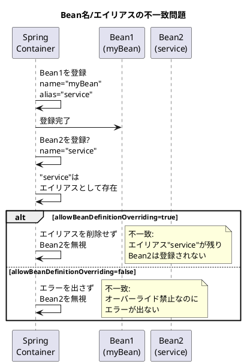
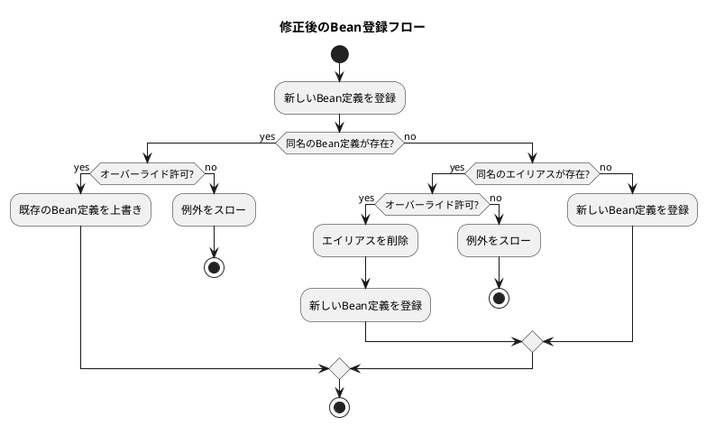
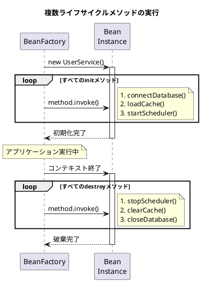
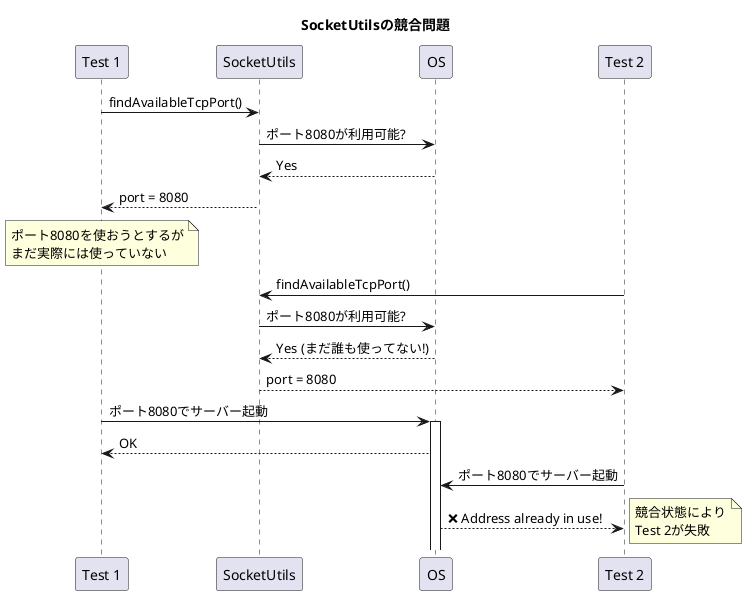
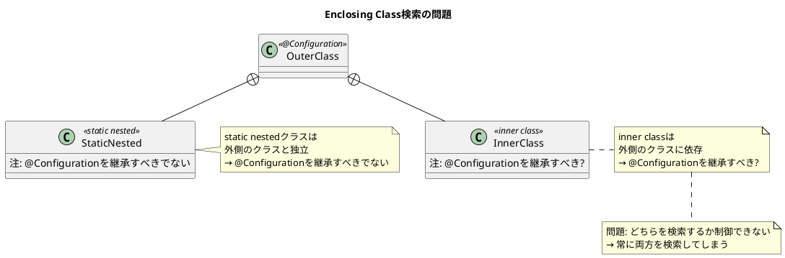

# Issue #27866/28013/28054/28079: コアAPI改善とクリーンアップ

## 課題概要

Spring Framework 6.0.0-M3では、AOT対応以外にも、既存APIの改善、非推奨機能の削除、一貫性の向上など、複数のコア機能の改善が行われました。

### 課題の概要

| Issue | タイトル | カテゴリ | 影響 |
|-------|---------|---------|------|
| #27866 | Bean名/エイリアスオーバーライドの一貫性 | バグ修正 | Bean定義の信頼性向上 |
| #28013 | 複数のinit/destroyメソッド対応 | AOT拡張 | ライフサイクル処理の強化 |
| #28054 | SocketUtils削除 | クリーンアップ | 非推奨APIの整理 |
| #28079 | Enclosing class検索戦略の非推奨化 | API整理 | アノテーション検索の明確化 |

## Issue #27866: Bean名/エイリアスオーバーライドの一貫性

### 背景知識

**Beanの名前とエイリアス**

Springでは、1つのBeanに複数の名前(エイリアス)を付けることができます。

```java
@Configuration
public class AppConfig {
    // "userService"という名前で登録され、"service", "userSvc"というエイリアスも持つ
    @Bean(name = {"userService", "service", "userSvc"})
    public UserService userService() {
        return new UserService();
    }
}

// 以下のいずれでも取得可能
context.getBean("userService");  // ✓
context.getBean("service");      // ✓
context.getBean("userSvc");      // ✓
```

### 問題の再現

```java
@Configuration
public class ProblematicConfig {
    // Bean1: "myBean"という名前で"service"というエイリアスも持つ
    @Bean(name = {"myBean", "service"})
    public MyInterface bean1() {
        return new Bean1();
    }
    
    // Bean2: "service"という名前で登録しようとする
    @Bean
    public MyInterface service() {
        return new Bean2();
    }
}

// 期待: エラーが発生するか、Bean2がBean1の"service"エイリアスを上書き
// 実際: Bean2が無視され、エラーも出ない!
```

**発生する問題**



### 原因

`DefaultListableBeanFactory`のBean登録ロジックに2つの不一致がありました:

1. **オーバーライド禁止時の問題**: `allowBeanDefinitionOverriding=false`(Spring Bootのデフォルト)の場合、既存のエイリアスを上書きしようとしてもエラーが発生しない

2. **オーバーライド許可時の問題**: `allowBeanDefinitionOverriding=true`の場合、新しいBean定義が登録されるが、同名のエイリアスが削除されない

```java
// 問題があったコード(簡略化)
public void registerBeanDefinition(String beanName, BeanDefinition beanDefinition) {
    BeanDefinition existingDefinition = this.beanDefinitionMap.get(beanName);
    
    if (existingDefinition != null) {
        if (!isAllowBeanDefinitionOverriding()) {
            throw new BeanDefinitionOverrideException(beanName);
        }
        // 上書き
        this.beanDefinitionMap.put(beanName, beanDefinition);
    } else {
        // 新規登録
        this.beanDefinitionMap.put(beanName, beanDefinition);
        
        // ❌ 問題: エイリアスとして同名が存在する場合のチェックがない!
    }
}
```

### セキュリティ上の懸念

報告者が指摘したセキュリティリスク:

```java
@Configuration
public class SecurityRisk {
    // 管理者用サービス
    @Bean(name = {"adminService", "backup"})
    public AdminService adminService() {
        return new AdminService(); // 強力な権限を持つ
    }
    
    // 後から追加された一般ユーザー用サービス
    @Bean
    public UserService backup() { // "backup"という名前を再利用しようとする
        return new UserService(); // 限定的な権限
    }
}

// ❌ 危険: backup()が無視され、adminServiceが使われる可能性
// 開発者は気づかないまま、意図しない強い権限を持つBeanが使用される
```

### 対応方針

#### 修正内容

**1. 一貫したオーバーライド処理**

```java
// 修正後のコード(簡略化)
public void registerBeanDefinition(String beanName, BeanDefinition beanDefinition) {
    BeanDefinition existingDefinition = this.beanDefinitionMap.get(beanName);
    String existingBeanName = this.aliasMap.get(beanName); // ✓ エイリアスもチェック
    
    if (existingDefinition != null) {
        if (!isAllowBeanDefinitionOverriding()) {
            throw new BeanDefinitionOverrideException(beanName);
        }
        // 上書き
        this.beanDefinitionMap.put(beanName, beanDefinition);
    } 
    else if (existingBeanName != null) {
        // ✓ エイリアスとして存在する場合
        if (!isAllowBeanDefinitionOverriding()) {
            throw new BeanDefinitionOverrideException(
                beanName, "conflicts with existing alias for " + existingBeanName);
        }
        // エイリアスを削除して新しいBean定義を登録
        this.aliasMap.remove(beanName);
        this.beanDefinitionMap.put(beanName, beanDefinition);
    } 
    else {
        // 新規登録
        this.beanDefinitionMap.put(beanName, beanDefinition);
    }
}
```

**2. 動作の一貫性**

| シナリオ | オーバーライド禁止 | オーバーライド許可 |
|---------|-----------------|-----------------|
| Bean名の衝突 | ❌ 例外をスロー | ✓ 上書き |
| エイリアスとBean名の衝突(修正前) | ⚠️ 無視(不一致!) | ⚠️ エイリアス残存(不一致!) |
| エイリアスとBean名の衝突(修正後) | ❌ 例外をスロー | ✓ エイリアス削除して上書き |

**フロー図**



### コミットでの変更

- [6b1c2dc](https://github.com/spring-projects/spring-framework/commit/6b1c2dc944e9541720d8fd7de3ce3c54ca03d5c2): Bean名/エイリアス間のオーバーライド一貫性を修正

## Issue #28013: 複数のinit/destroyメソッド対応

### 背景知識

**Beanのライフサイクルメソッド**

Springでは、Beanの初期化/破棄時に特定のメソッドを実行できます:

```java
public class UserService {
    private DataSource dataSource;
    
    // 初期化メソッド: Bean生成後に自動実行
    public void init() {
        System.out.println("Initializing UserService");
    }
    
    // 破棄メソッド: コンテキスト終了時に自動実行
    public void cleanup() {
        System.out.println("Cleaning up UserService");
    }
}

@Configuration
public class AppConfig {
    @Bean(initMethod = "init", destroyMethod = "cleanup")
    public UserService userService() {
        return new UserService();
    }
}
```

**JSR-250アノテーション**

```java
import jakarta.annotation.PostConstruct;
import jakarta.annotation.PreDestroy;

public class UserService {
    @PostConstruct
    public void init1() {
        System.out.println("First init");
    }
    
    @PostConstruct
    public void init2() {
        System.out.println("Second init");
    }
    
    @PreDestroy
    public void cleanup1() {
        System.out.println("First cleanup");
    }
    
    @PreDestroy
    public void cleanup2() {
        System.out.println("Second cleanup");
    }
}

// 実行時には、すべての@PostConstruct/@PreDestroyメソッドが呼ばれる
```

### 問題

**従来の制限**

`BeanDefinition`では1つのinit/destroyメソッド名しか指定できませんでした:

```java
RootBeanDefinition beanDef = new RootBeanDefinition(UserService.class);
beanDef.setInitMethodName("init1");       // ✓ 1つだけ
beanDef.setDestroyMethodName("cleanup1"); // ✓ 1つだけ

// ❌ 複数指定はできない
// beanDef.setInitMethodName("init1", "init2"); // コンパイルエラー
```

しかし、`InitDestroyAnnotationBeanPostProcessor`は実行時に`@PostConstruct`/`@PreDestroy`を探して**複数のメソッドを呼び出す**ことができます。

**AOTでの課題**

AOT処理では、リフレクションを避けるため、ビルド時にすべてのライフサイクルメソッドを特定してコード生成する必要があります:

```java
// AOTで生成したいコード
BeanDefinitionRegistrar.of("userService", UserService.class)
    .instanceSupplier(() -> new UserService())
    .customize(bd -> {
        bd.setInitMethodNames("init1", "init2");      // ❌ 従来は不可能
        bd.setDestroyMethodNames("cleanup1", "cleanup2"); // ❌ 従来は不可能
    })
    .register(beanFactory);
```

### 対応方針

#### 新しいAPI

```java
// RootBeanDefinitionに追加されたメソッド
public class RootBeanDefinition extends AbstractBeanDefinition {
    @Nullable
    private String[] initMethodNames;
    
    @Nullable
    private String[] destroyMethodNames;
    
    /**
     * 複数の初期化メソッド名を設定
     */
    public void setInitMethodNames(String... initMethodNames) {
        this.initMethodNames = initMethodNames;
    }
    
    /**
     * 複数の破棄メソッド名を設定
     */
    public void setDestroyMethodNames(String... destroyMethodNames) {
        this.destroyMethodNames = destroyMethodNames;
    }
    
    public String[] getInitMethodNames() {
        return this.initMethodNames;
    }
    
    public String[] getDestroyMethodNames() {
        return this.destroyMethodNames;
    }
}
```

#### 実装

```java
// AOTで生成されるコード例
public class __BeanRegistrations {
    public static void registerUserService(DefaultListableBeanFactory factory) {
        RootBeanDefinition bd = new RootBeanDefinition(UserService.class);
        
        // 複数のライフサイクルメソッドを設定
        bd.setInitMethodNames("connectDatabase", "loadCache", "startScheduler");
        bd.setDestroyMethodNames("stopScheduler", "clearCache", "closeDatabase");
        
        bd.setInstanceSupplier(() -> new UserService());
        factory.registerBeanDefinition("userService", bd);
    }
}
```

**実行時の処理**



### 注意事項

現時点では、この機能は**AOT処理専用**です:

```java
// ❌ 通常の@Bean設定では使用できない
@Bean(initMethod = {"init1", "init2"}) // コンパイルエラー
public UserService userService() {
    return new UserService();
}

// ✓ AOT生成コードでのみ使用
RootBeanDefinition bd = new RootBeanDefinition(UserService.class);
bd.setInitMethodNames("init1", "init2"); // プログラム的に設定
```

将来的に`@Bean`アノテーションで配列をサポートする可能性については議論されていますが、現時点では未実装です。

### コミットでの変更

- [41ee233](https://github.com/spring-projects/spring-framework/commit/41ee23345d72623d18accb9484ce5119403c39d5): 複数のinit/destroyメソッド名のサポートを追加

## Issue #28054: 非推奨のSocketUtilsを削除

### 背景

**SocketUtilsとは**

`SocketUtils`は、テストで利用可能なポート番号を見つけるためのユーティリティクラスでした:

```java
import org.springframework.util.SocketUtils;

@Test
public void testServer() {
    // ランダムに利用可能なポートを取得
    int port = SocketUtils.findAvailableTcpPort();
    
    // テストサーバーを起動
    TestServer server = new TestServer(port);
    server.start();
    
    // テスト実行
    // ...
}
```

### 問題

**競合状態(Race Condition)**



### 対応方針

**代替手段**

ポート0を使用して、OSに自動割り当てさせる:

```java
// Before: SocketUtils(非推奨)
int port = SocketUtils.findAvailableTcpPort();
ServerSocket server = new ServerSocket(port);

// After: OS自動割り当て
ServerSocket server = new ServerSocket(0); // ポート0 = OS自動選択
int port = server.getLocalPort(); // 実際に割り当てられたポートを取得
```

**Spring Bootの場合**

```properties
# application-test.properties
server.port=0  # ランダムポートで起動
```

```java
@SpringBootTest(webEnvironment = WebEnvironment.RANDOM_PORT)
public class MyTest {
    @LocalServerPort
    private int port; // 実際に使われているポートが注入される
    
    @Test
    public void test() {
        String url = "http://localhost:" + port + "/api/users";
        // テスト実行
    }
}
```

### 削除の影響

**Spring Framework 5.3.18での対応**

完全削除の代わりに、テスト専用の`TestSocketUtils`が導入されました(#28210):

```java
// Spring Framework 5.3.18+
import org.springframework.test.util.TestSocketUtils;

@Test
public void test() {
    // 内部テスト用(公開APIではない)
    int port = TestSocketUtils.findAvailableTcpPort();
}
```

### コミットでの変更

- [ee51dab](https://github.com/spring-projects/spring-framework/commit/ee51dab1f348361f26c477ad64ab730ad7359d6e) 〜 [fb72f1f](https://github.com/spring-projects/spring-framework/commit/fb72f1fdade2591220d58e8a0d91d954c8824080): `SocketUtils`の削除

## Issue #28079: Enclosing Class検索戦略の非推奨化

### 背景知識

**MergedAnnotationsとは**

Spring Frameworkのアノテーション検索API:

```java
MergedAnnotations annotations = MergedAnnotations.from(
    MyClass.class, 
    SearchStrategy.TYPE_HIERARCHY // スーパークラスも検索
);

if (annotations.isPresent(Component.class)) {
    // @Componentが存在する
}
```

**検索戦略**

| 戦略 | 検索範囲 |
|-----|---------|
| `DIRECT` | 対象クラスのみ |
| `INHERITED_ANNOTATIONS` | 対象クラス + 継承されたアノテーション |
| `SUPERCLASS` | 対象クラス + スーパークラス |
| `TYPE_HIERARCHY` | 対象クラス + すべてのスーパークラス + インターフェース |
| `TYPE_HIERARCHY_AND_ENCLOSING_CLASSES` | 上記 + **外側のクラス** ⚠️ |

### 問題

**過度に広範な検索**

```java
public class OuterClass {
    @Component  // 外側のクラスのアノテーション
    public static class InnerClass {
        // このクラス自体には@Componentがない
    }
}

// TYPE_HIERARCHY_AND_ENCLOSING_CLASSESを使うと
MergedAnnotations annotations = MergedAnnotations.from(
    OuterClass.InnerClass.class,
    SearchStrategy.TYPE_HIERARCHY_AND_ENCLOSING_CLASSES
);

// ❌ 予期しない動作: InnerClassが@Componentを持っていると判定される!
annotations.isPresent(Component.class); // true
```

**問題のシナリオ**



### 当初の目的

JUnit Jupiter の`@Nested`テストクラスをサポートするために導入されました:

```java
@SpringBootTest
class OuterTest {
    @Nested
    class InnerTest {
        // OuterTestの@SpringBootTestを継承したい
    }
}
```

しかし、Spring TestContext Frameworkでは代わりに専用の`TestContextAnnotationUtils`を使用することになり、この検索戦略は不要になりました。

### 対応方針

**非推奨化(6.0 M3)**

```java
/**
 * @deprecated as of 6.0 M3, in favor of custom search strategies
 * that explicitly control enclosing class traversal
 */
@Deprecated(since = "6.0")
SearchStrategy TYPE_HIERARCHY_AND_ENCLOSING_CLASSES;
```

**代替手段**

必要に応じて、カスタム検索ロジックを実装:

```java
public class CustomAnnotationSearch {
    public static boolean hasAnnotation(Class<?> clazz, Class<? extends Annotation> annotationType) {
        // 1. 対象クラス自体を検索
        if (MergedAnnotations.from(clazz).isPresent(annotationType)) {
            return true;
        }
        
        // 2. 必要に応じてenclosing classを検索
        Class<?> enclosingClass = clazz.getEnclosingClass();
        if (enclosingClass != null && !Modifier.isStatic(clazz.getModifiers())) {
            // inner classの場合のみ、外側のクラスを検索
            return hasAnnotation(enclosingClass, annotationType);
        }
        
        return false;
    }
}
```

### Spring Bootでの使用

Spring Boot 2.xでは`@ConstructorBinding`の検出に使用していましたが、Spring Boot 3.0(Framework 6.0ベース)では不要になりました。

### コミットでの変更

- [29d9828](https://github.com/spring-projects/spring-framework/commit/29d98285bea8be459d0bdcaad655c84338c3d0e5) 〜 [c9cd53f](https://github.com/spring-projects/spring-framework/commit/c9cd53f469a7b3a79284542fe0222b0f9fd05785): `TYPE_HIERARCHY_AND_ENCLOSING_CLASSES`の非推奨化

## 影響範囲のまとめ

### 開発者への影響

| Issue | 影響 | 対応 |
|-------|------|------|
| #27866 | Bean名/エイリアスの競合が適切に検出される | 既存コードの検証推奨 |
| #28013 | AOT生成コードが改善される | 通常の開発者には影響なし |
| #28054 | `SocketUtils`が使用不可 | ポート0またはテストフレームワーク機能を使用 |
| #28079 | `TYPE_HIERARCHY_AND_ENCLOSING_CLASSES`が非推奨 | カスタム検索ロジックに移行 |

### 推奨アクション

1. **Bean定義のレビュー**: 名前とエイリアスの競合がないか確認
2. **テストコードの更新**: `SocketUtils`を使用している場合は代替手段に移行
3. **アノテーション検索の見直し**: `TYPE_HIERARCHY_AND_ENCLOSING_CLASSES`を使用している場合は代替実装を検討
