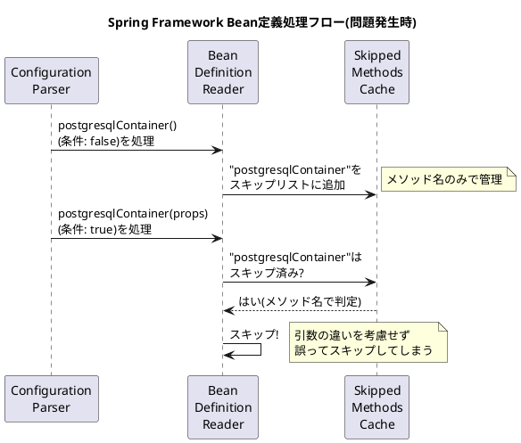
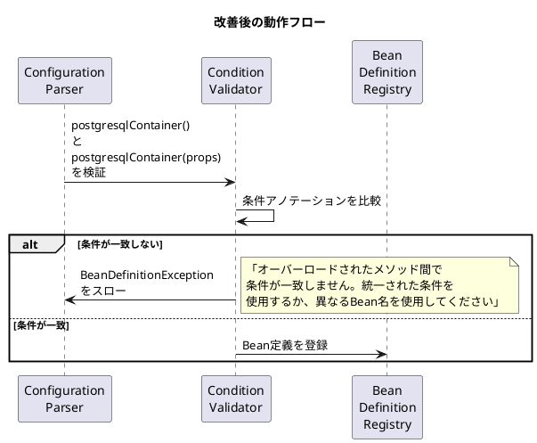

# Issue #22609: @Beanメソッドのオーバーロードによる条件不一致問題

## 課題概要

### 背景知識

**Spring Beanとは**

Spring FrameworkにおけるBeanとは、Springコンテナ(ApplicationContext)によって管理されるオブジェクトのことです。Javaの設定クラスで`@Bean`アノテーションを付けたメソッドを定義することで、そのメソッドが返すオブジェクトをBeanとして登録できます。

**条件付きBean定義**

`@ConditionalOnProperty`アノテーションを使用すると、設定ファイル(application.properties/yml)の値に基づいて、Beanを作成するかどうかを制御できます。例えば、本番環境と開発環境で異なるBeanを使い分けたい場合に有用です。

**メソッドのオーバーロード**

Javaでは、同じメソッド名で異なる引数を持つメソッドを複数定義できます(オーバーロード)。しかし、Spring Frameworkの`@Bean`メソッドでこれを行うと、予期しない動作が発生する可能性があります。

### 問題の詳細

開発者が以下のような設定を行った際に、分かりにくいエラーが発生しました:

```java
@Configuration
public class PersistenceConfig {
  @Configuration
  public class DbServersConfig {
    // 条件1: postgresql.enabled=trueの場合
    @Bean("postgresqlContainer")
    @ConditionalOnProperty(name = "enabled", havingValue = "true")
    public PostgreSQLContainer postgresqlContainer(TCPostgresqlProperties props) {
      return new PostgreSQLContainer(props);
    }

    // 条件2: postgresql.enabled=falseの場合
    @Bean("postgresqlContainer")
    @ConditionalOnProperty(name = "enabled", havingValue = "false")
    public PostgreSQLContainer postgresqlContainer() {
      return null;
    }
  }
}
```

この設定は、「メソッド名が同じ(オーバーロード)」で「異なる条件」を持つため、Spring Frameworkが正しく処理できませんでした。

### 動作の図解



### 期待される動作と実際の動作

| 観点 | 期待される動作 | 実際の動作 |
|------|--------------|-----------|
| Bean定義の認識 | 2つの異なるメソッド(引数が異なる)として認識 | 同一メソッド名で同一のBean定義として認識 |
| 条件の適用 | 各メソッドの条件を個別に評価 | 処理順序に依存し、予測不能 |
| エラー通知 | 条件の競合を検出して例外をスロー | 分かりにくいエラーメッセージ |

## 原因

### 技術的な原因

Spring Frameworkの`ConfigurationClassBeanDefinitionReader`クラスでは、スキップされたBeanメソッドを**メソッド名のみ**で追跡していました。

```java
// 問題のあるロジック(簡略化)
if (configClass.skippedBeanMethods.contains(methodName)) {
    // メソッド名だけで判定しているため、引数が異なっても同一視される
    return; // スキップ
}
```

この実装により、以下の問題が発生します:

1. **オーバーロードされたメソッドの区別ができない**: メソッド名が同じであれば、引数リストが異なっていても同一のメソッドとして扱われる
2. **処理順序への依存**: どちらのメソッドが先に処理されるかによって、結果が変わる
3. **条件の不一致を検出できない**: 同じBean名に対して異なる条件が設定されていても、警告やエラーが出ない

### 設計上の背景

Spring Frameworkの設計では、以下の原則がありました:

- **Bean名の一意性**: 1つのBean名に対して、1つのBean定義のみが存在する
- **メタデータのマージ**: 同じBean名を持つ複数の`@Bean`メソッドは、概念的に1つの定義にマージされる
- **オーバーロードの扱い**: `@Bean`メソッドのオーバーロードは、クラスのコンストラクタオーバーロードと同様に扱われる

しかし、これらの原則が条件付きBean定義と組み合わさった場合、開発者の期待と異なる動作を引き起こしました。

## 対応方針

### 短期的な対応(回避策)

開発者は以下の回避策を使用できます:

**方法1: メソッド名を変える(推奨)**

```java
@Bean("postgresqlContainer")
@ConditionalOnProperty(name = "enabled", havingValue = "true")
public PostgreSQLContainer postgresqlContainerEnabled(TCPostgresqlProperties props) {
    return new PostgreSQLContainer(props);
}

@Bean("postgresqlContainer")
@ConditionalOnProperty(name = "enabled", havingValue = "false")
public PostgreSQLContainer postgresqlContainerDisabled() {
    return null;
}
```

**方法2: 条件を統一する**

```java
@Bean("postgresqlContainer")
@ConditionalOnProperty(name = "enabled", havingValue = "true")
@ConditionalOnProperty(name = "enabled", havingValue = "true") // 両方に同じ条件
public PostgreSQLContainer postgresqlContainer(TCPostgresqlProperties props) {
    return new PostgreSQLContainer(props);
}

@Bean("postgresqlContainer")
@ConditionalOnProperty(name = "enabled", havingValue = "true")
@ConditionalOnProperty(name = "enabled", havingValue = "true") // 両方に同じ条件
public PostgreSQLContainer postgresqlContainer() {
    return null;
}
```

### 長期的な対応(Framework改善)

Spring Framework 6.0で実装された改善:

#### 1. 条件の不一致検出

オーバーロードされた`@Bean`メソッド間で条件アノテーションが一致しない場合、例外をスローするようにしました。



#### 2. ドキュメントの改善

以下の内容を公式ドキュメントに追加:

| 項目 | 内容 |
|------|------|
| ベストプラクティス | `@Bean`メソッドのオーバーロードは避け、明確なメソッド名を使用する |
| オーバーロード時の注意 | すべてのオーバーロードメソッドに同じアノテーションを付ける |
| 実行時の動作 | オーバーロードされたメソッドは1つのBean定義として扱われる |
| 条件付き定義 | 異なる条件を使用する場合は、異なるBean名を使用する |

#### 3. エラーメッセージの改善

従来の分かりにくいエラーメッセージから、具体的な解決策を提示するメッセージに改善:

**改善前:**
```
A component required a bean named 'postgresqlContainer' that could not be found.
```

**改善後:**
```
Bean definition conflict detected for bean 'postgresqlContainer':
- Multiple @Bean methods with the same name have conflicting @Conditional annotations
- Method 1: postgresqlContainer() with @ConditionalOnProperty(havingValue="false")
- Method 2: postgresqlContainer(TCPostgresqlProperties) with @ConditionalOnProperty(havingValue="true")

Recommended solutions:
1. Use distinct method names (e.g., 'postgresqlContainerEnabled' and 'postgresqlContainerDisabled')
2. Apply the same conditional annotations to all overloaded methods
```

### コミットでの変更内容

関連コミットでは、以下の変更が実装されました:

1. **条件の一致性チェック追加**: `ConfigurationClassBeanDefinitionReader`に、オーバーロードされたメソッド間で条件アノテーションの一致性を検証するロジックを追加
2. **例外クラスの拡張**: より詳細な情報を含む`BeanDefinitionConflictException`を導入
3. **テストケースの追加**: 条件不一致を検出することを確認する統合テストを追加

### 影響範囲

この変更により、既存のアプリケーションで以下の影響が考えられます:

- **破壊的変更**: 従来は（偶然）動作していた条件不一致の設定が、エラーとして検出されるようになる
- **移行パス**: アプリケーション起動時に例外が発生するため、開発者は問題を早期に発見し修正できる
- **後方互換性**: 正しく設定されていたアプリケーションには影響なし
